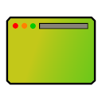

# Adaptive-Tab-Theme

Changes the color of Firefox theme to match the website’s appearance.

---

**What Does the Add-on Do?**

This add-on dynamically adjusts the Firefox theme to match the appearance of the website you are viewing, similar to the tab bar tinting feature in Safari on macOS.

**Works Well With**

- [Dark Reader](https://addons.mozilla.org/firefox/addon/darkreader/)
- [Stylus](https://addons.mozilla.org/firefox/addon/styl-us/)
- [Dark Mode Website Switcher](https://addons.mozilla.org/firefox/addon/dark-mode-website-switcher/)

**Incompatible With**

- [Adaptive Theme Creator](https://addons.mozilla.org/firefox/addon/adaptive-theme-creator/)
- [Chameleon Dynamic Theme](https://addons.mozilla.org/firefox/addon/chameleon-dynamic-theme-fixed/)
- [VivaldiFox](https://addons.mozilla.org/firefox/addon/vivaldifox/)
- [Envify](https://addons.mozilla.org/firefox/addon/envify/)
- Any other add-on that modifies the Firefox theme

**Removing the Shadow at the Bottom of the Toolbar**

To remove the thin shadow cast by web content onto the browser toolbar, navigate to Settings (`about:preferences`) and disable “Show sidebar” in the “Browser Layout” section. Alternatively, add the following code to your CSS theme:

> `#tabbrowser-tabbox, .browserContainer {`

> `box-shadow: none !important;`

> `}`

**Customising color Transitions**

Due to technical limitations, smooth color transitions for the tab bar are not natively supported. However, you can enable this effect by adding the following code to your CSS theme:

> `#navigator-toolbox, #TabsToolbar, #nav-bar, #PersonalToolbar, #sidebar-box, .tab-background, .urlbar-background, findbar {`

> `transition:`

> `background-color 0.5s cubic-bezier(0, 0, 0, 1), border-color 0.5s cubic-bezier(0, 0, 0, 1) !important;`

> `}`

To enable smooth color transitions in the Sidebery UI, add the following code to the Sidebery Style Editor:

> `.Sidebar, .bottom-space {`

> `transition: background-color 0.5s cubic-bezier(0, 0, 0, 1) !important;`

> `}`

Alternatively, if you wish to remove Firefox’s built-in color transition on the toolbar for an instant color change, add the following code to your CSS theme:

> `:root {`

> `--ext-theme-background-transition: none !important;`

> `}`

**Compatibility with Third-Party CSS Themes**

A third-party CSS theme works with Adaptive Tab Theme, as long as they use Firefox’s standard color variables (e.g. `--lwt-accent-color` for the tab bar color).

**Title Bar Buttons on Linux with GTK Theme**

Firefox’s titlebar buttons may revert to the Windows style. To prevent this, open “Advanced Preferences” (`about:config`) and set `widget.gtk.non-native-titlebar-buttons.enabled` to `false`.

**Safety Reminder**

Beware of malicious web UIs. It is important to distinguish between the browser UI and the web UI. For further information, please refer to [The Line of Death](https://textslashplain.com/2017/01/14/the-line-of-death/).
